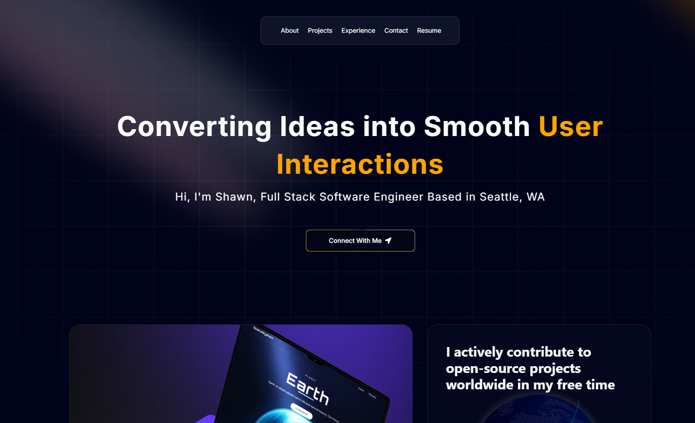
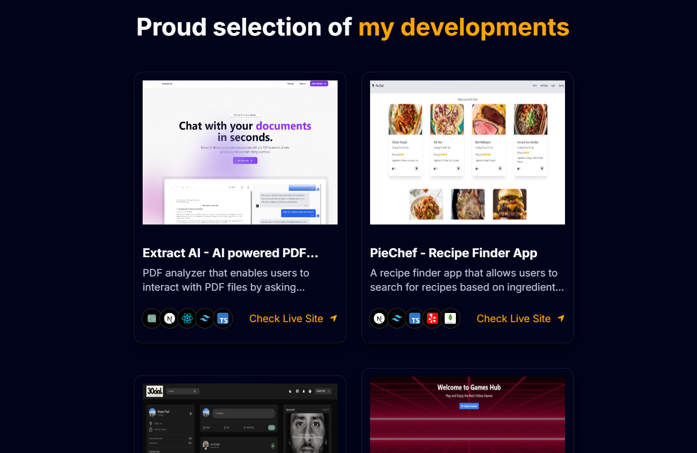

# Animate Portfolio

Animate Portfolio is a modern, interactive portfolio website built to showcase creative projects and personal work in a visually appealing and dynamic way. It utilizes 3D animations, interactive components, and smooth transitions to create an engaging experience.




## Features

- 3D visualizations with Three.js and React Three Fiber
- Smooth animations powered by Framer Motion
- Dark mode and theme switching using Next Themes
- Interactive globe visualization with Three Globe
- Responsive design with Tailwind CSS

## Tech Stack

### Frontend

- **React**: ^18
- **Next.js**: 14.2.11
- **TypeScript**: ^5
- **Tailwind CSS**: ^3.4.1
- **Framer Motion**: ^11.5.4
- **Three.js**: ^0.168.0
- **React Three Fiber**: ^8.17.7
- **React Lottie**: ^1.2.4
- **React Icons**: ^5.3.0

### Development Tools

- **ESLint**: ^8 (Linting)
- **TypeScript**: Strongly typed language support
- **PostCSS**: CSS transformations and utilities

## Installation

### Prerequisites

- Node.js

### Setup

1. Clone the repository:

   ```bash
   git clone https://github.com/yourusername/animate-portfolio.git
   ```

2. Navigate to the project directory:

   ```bash
   cd animate-portfolio
   ```

3. Install the dependencies:

   ```bash
   npm install
   ```

4. Start the development server:

   ```bash
   npm run dev
   ```

5. Build the project for production:

   ```bash
   npm run build
   ```

6. Start the production server:
   ```bash
   npm run start
   ```

## Usage

Once the server is running, you can view the portfolio at `http://localhost:3000`.

## License

This project is licensed under the ISC License.
